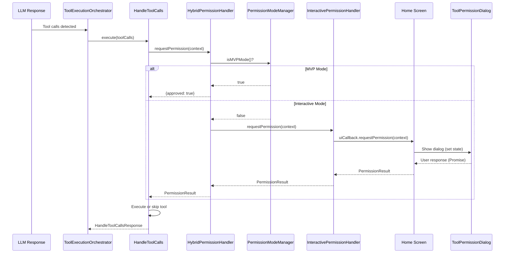

# Design Document: Permission Mode Fix

## Overview

Hệ thống permission modes cho phép người dùng kiểm soát việc AI có thể tự động thực thi tools hay cần xin phép trước. Feature này sửa lỗi UI callback không được kết nối, khiến dialog xin quyền không hiển thị khi ở Interactive mode.

**Vấn đề hiện tại:**
- `setUICallback` không được gọi ở đâu trong codebase
- `ToolPermissionDialog` component tồn tại nhưng không được render
- Khi ở Interactive mode, fallback auto-approve thay vì hiển thị dialog

**Giải pháp:**
- Kết nối UI callback trong Home screen initialization
- Thêm state management cho permission request
- Render ToolPermissionDialog trong Home screen

## Architecture



## Components and Interfaces

### 1. PermissionUICallback (Existing - No changes)

```typescript
export interface PermissionUICallback {
  requestPermission: (context: ToolPermissionContext) => Promise<PermissionResult>;
}
```

### 2. Home Screen State (New)

```typescript
interface PermissionDialogState {
  isOpen: boolean;
  request: ToolPermissionRequest | null;
  resolve: ((result: PermissionResult) => void) | null;
}
```

### 3. usePermissionDialog Hook (New)

```typescript
interface UsePermissionDialogReturn {
  dialogState: PermissionDialogState;
  showDialog: (context: ToolPermissionContext) => Promise<PermissionResult>;
  handleApprove: () => void;
  handleDeny: () => void;
  handleAlwaysAllow: () => void;
}
```

### 4. ToolPermissionDialog (Existing - Modify)

Cập nhật layout từ horizontal buttons sang vertical list với keyboard navigation.

```typescript
interface ToolPermissionDialogProps {
  request: ToolPermissionRequest | null;
  onApprove: () => void;
  onDeny: () => void;
  onAlwaysAllow: () => void;
}
```

## Data Models

### ToolPermissionRequest (Existing)

```typescript
interface ToolPermissionRequest {
  toolName: string;
  toolDescription?: string;
  arguments: Record<string, any>;
  timestamp: Date;
}
```

### PermissionResult (Existing)

```typescript
interface PermissionResult {
  approved: boolean;
  reason?: string;
  rememberChoice?: boolean;
}
```

## Correctness Properties

*A property is a characteristic or behavior that should hold true across all valid executions of a system-essentially, a formal statement about what the system should do. Properties serve as the bridge between human-readable specifications and machine-verifiable correctness guarantees.*

### Property 1: MVP Mode Auto-Approves All Tools
*For any* tool call in MVP mode, the permission handler SHALL return `{approved: true}` without invoking UI callback.
**Validates: Requirements 2.1, 2.2, 3.3**

### Property 2: Interactive Mode Shows Dialog
*For any* tool call in Interactive mode (without pre-approval), the permission handler SHALL invoke UI callback and wait for user response.
**Validates: Requirements 1.1, 1.2, 4.3**

### Property 3: Dialog Blocks Execution Until Response
*For any* permission request in Interactive mode, the Promise SHALL remain pending until user responds (approve/deny/always-allow).
**Validates: Requirements 1.2, 10.1, 10.3, 11.1**

### Property 4: Approval Executes Tool
*For any* tool call where user approves, the tool SHALL be executed and result returned.
**Validates: Requirements 1.3, 11.2**

### Property 5: Denial Skips Tool and Reports to LLM
*For any* tool call where user denies, the tool SHALL NOT be executed and rejection SHALL be reported to LLM.
**Validates: Requirements 1.4, 9.1, 9.2, 11.3**

### Property 6: Always-Allow Adds to Pre-Approved List
*For any* tool where user selects "Always Allow", the tool SHALL be added to pre-approved list and future calls SHALL skip dialog.
**Validates: Requirements 1.5, 11.4**

### Property 7: Keyboard Navigation Cycles Through Options
*For any* sequence of Up/Down key presses, the selection SHALL cycle through options (Allow → Deny → Always Allow → Allow).
**Validates: Requirements 6.2**

### Property 8: Shortcut Keys Trigger Correct Actions
*For any* shortcut key press (Y/N/A/Escape), the corresponding action SHALL be triggered immediately.
**Validates: Requirements 6.4, 6.5, 6.6, 6.7**

### Property 9: Mode Toggle Updates Behavior Immediately
*For any* mode toggle (Shift+Tab), the next permission request SHALL use the new mode's behavior.
**Validates: Requirements 3.1, 3.2, 3.3**

### Property 10: Partial Approval Executes Approved Tools Only
*For any* batch of tool calls where some are approved and some denied, only approved tools SHALL be executed.
**Validates: Requirements 9.3**

## Error Handling

| Error Case | Handling Strategy |
|------------|-------------------|
| UI callback not registered | Log warning, fallback to auto-approve (MVP behavior) |
| Dialog timeout (optional) | Auto-deny after configurable timeout |
| User closes terminal during dialog | Treat as denial |
| Invalid tool call | Skip with error, report to LLM |

## Testing Strategy

### Unit Tests

1. **PermissionModeManager Tests**
   - Test mode toggle
   - Test listener notification
   - Test initial state

2. **HybridPermissionHandler Tests**
   - Test delegation to correct handler based on mode
   - Test pre-approval check

3. **InteractivePermissionHandler Tests**
   - Test UI callback invocation
   - Test pre-approval management
   - Test fallback when no callback

### Property-Based Tests

Sử dụng **fast-check** library cho TypeScript.

Mỗi property test PHẢI:
- Chạy tối thiểu 100 iterations
- Tag với comment format: `**Feature: permission-mode-fix, Property {number}: {property_text}**`
- Reference requirement clause

**Property Tests to Implement:**

1. **Property 1**: MVP mode auto-approval
2. **Property 2**: Interactive mode dialog invocation
3. **Property 3**: Promise blocking behavior
4. **Property 4**: Approval execution flow
5. **Property 5**: Denial and LLM reporting
6. **Property 6**: Always-allow pre-approval
7. **Property 7**: Keyboard navigation cycling
8. **Property 8**: Shortcut key actions
9. **Property 9**: Mode toggle immediate effect
10. **Property 10**: Partial approval handling

### Integration Tests

1. **Full Flow Test**: LLM → Tool Call → Permission → Execution → Response
2. **Mode Switching During Execution**: Verify mode change doesn't affect in-progress requests
