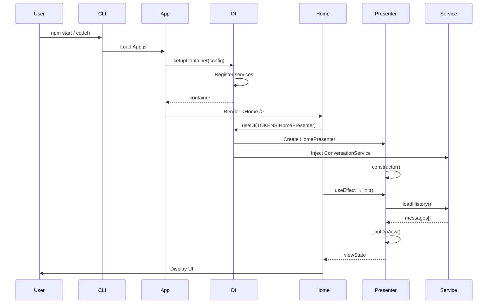

# 🔄 Application Startup Flow

> **Phần 1/9** - Flow Diagrams | [Next: User Input →](./02-user-input.md) | [Up: Index ↑](../README.md)

---

## Sequence Diagram

---

## Chi tiết

1. CLI khởi động từ `npm start` hoặc binary `codeh`
2. App.js setup DI container với config từ env
3. Home component mount và resolve presenter từ DI
4. Presenter inject ConversationService
5. useEffect gọi init() để load history
6. View update và render UI

---

## 🔗 Navigation

[Next: User Input →](./02-user-input.md) | [Up: Index ↑](../README.md)

---

**Last Updated**: 2025-01-08 | **Part**: 1/9
