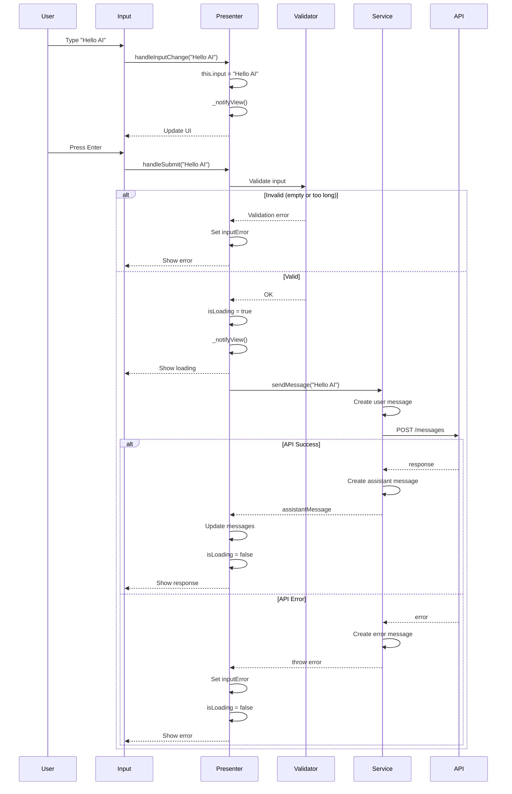

# 🎯 User Input Processing Flow

> **Phần 2/9** - Flow Diagrams | [← Prev: Startup](./01-startup.md) | [Next: Slash Commands →](./03-slash-commands.md) | [Up: Index ↑](../README.md)

---

## Sequence Diagram



---

## Validation Steps

```javascript
// Step 1: Empty check
if (!userInput.trim()) {
	throw 'Please enter a message';
}

// Step 2: Length check
if (userInput.length > 10000) {
	throw 'Message too long (max 10,000 characters)';
}

// Step 3: API check
if (!this.apiClient) {
	throw 'API not configured';
}
```

---

## 🔗 Navigation

[← Prev: Startup](./01-startup.md) | [Next: Slash Commands →](./03-slash-commands.md) | [Up: Index ↑](../README.md)

---

**Last Updated**: 2025-01-08 | **Part**: 2/9
