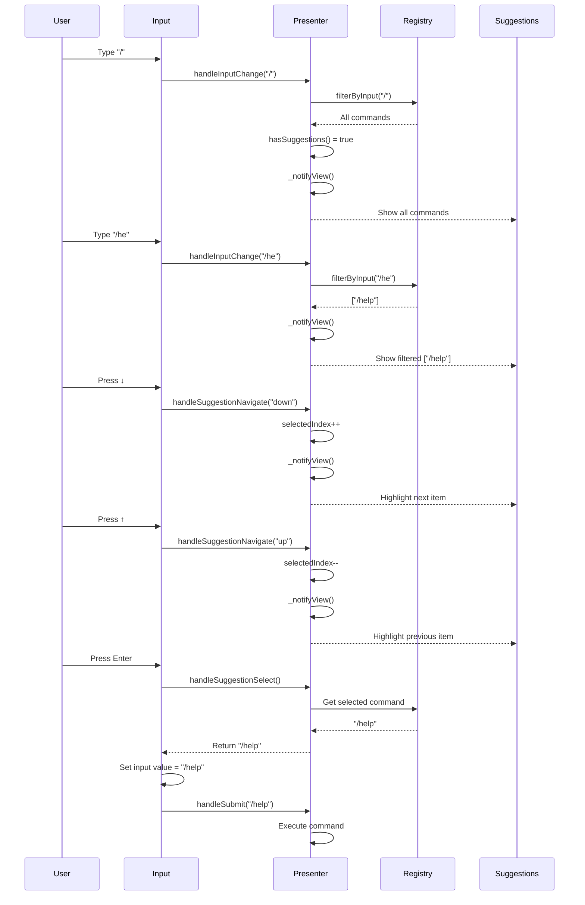

# ⚡ Slash Command Flow

> **Phần 3/9** - Flow Diagrams | [← Prev: User Input](./02-user-input.md) | [Next: Error Handling →](./04-error-handling.md) | [Up: Index ↑](../README.md)

---

## Sequence Diagram



---

## Command Registry

```javascript
// Centralized in SlashCommand.js
const COMMANDS = [
  { cmd: '/help', desc: 'Show help', category: 'CONVERSATION' },
  { cmd: '/clear', desc: 'Clear history', category: 'CONVERSATION' },
  { cmd: '/model', desc: 'Change model', category: 'CONFIGURATION' },
  { cmd: '/config', desc: 'Configure', category: 'CONFIGURATION' },
  { cmd: '/todos', desc: 'Show todos', category: 'DEVELOPMENT' },
  { cmd: '/exit', desc: 'Exit app', category: 'SYSTEM' },
]

// With aliases support
{ cmd: '/help', aliases: ['/h', '/?'] }
```

---

## 🔗 Navigation

[← Prev: User Input](./02-user-input.md) | [Next: Error Handling →](./04-error-handling.md) | [Up: Index ↑](../README.md)

---

**Last Updated**: 2025-01-08 | **Part**: 3/9
