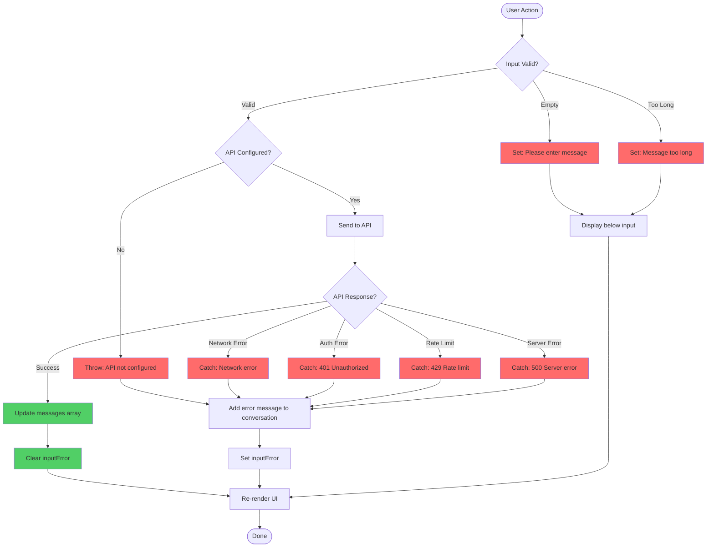

# 🚨 Error Handling Flow

> **Phần 4/9** - Flow Diagrams | [← Prev: Slash Commands](./03-slash-commands.md) | [Next: State Updates →](./05-state-updates.md) | [Up: Index ↑](../README.md)

---

## Flowchart



---

## Error Display Strategy

```
┌─────────────────────────────────────┐
│ ConversationArea                    │
│                                     │
│ > You: Hello                        │
│ ✗ Error: API not configured         │ ← Error role message
│                                     │
└─────────────────────────────────────┘
┌─────────────────────────────────────┐
│ ⚠ Message too long (max 10,000...) │ ← inputError
├─────────────────────────────────────┤
│ > Your very long message_           │
└─────────────────────────────────────┘
```

---

## 🔗 Navigation

[← Prev: Slash Commands](./03-slash-commands.md) | [Next: State Updates →](./05-state-updates.md) | [Up: Index ↑](../README.md)

---

**Last Updated**: 2025-01-08 | **Part**: 4/9
