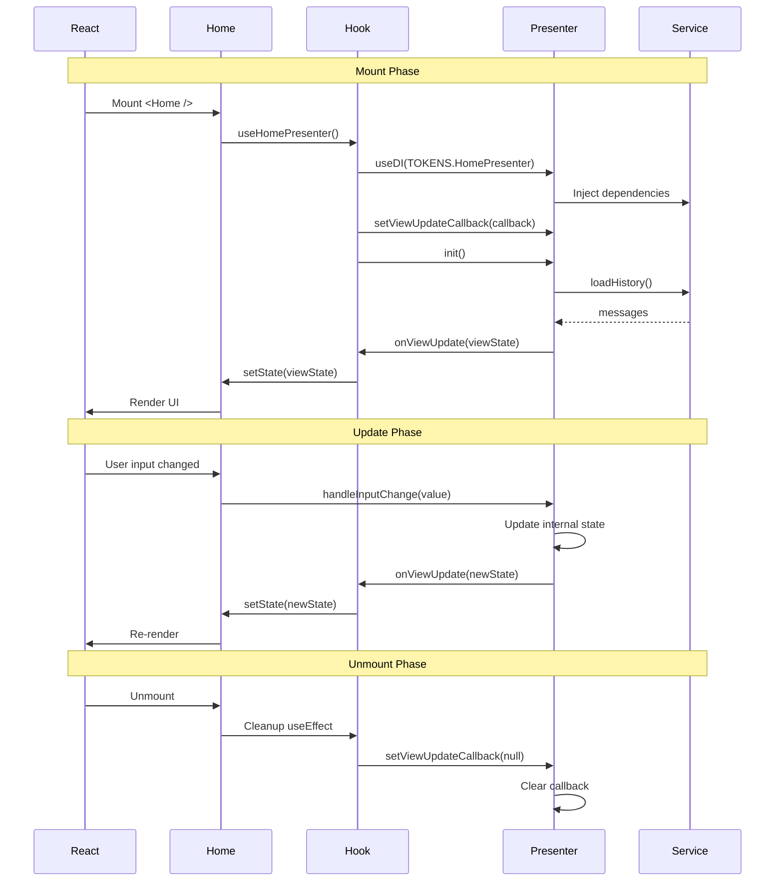
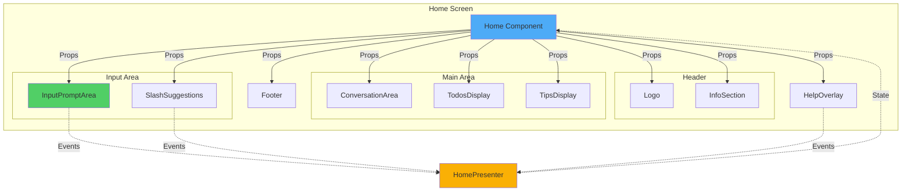

# 🔄 Component Lifecycle & Communication

> **Phần 6/9** - Flow Diagrams | [← Prev: State Updates](./05-state-updates.md) | [Next: Loading States →](./07-loading-states.md) | [Up: Index ↑](../README.md)

---

## Lifecycle Sequence



---

## Component Communication



---

## Lifecycle Hooks

```javascript
// Mount
useEffect(() => {
	presenter.setViewUpdateCallback(handleUpdate);
	presenter.init(); // Load initial data

	return () => {
		// Unmount
		presenter.setViewUpdateCallback(null);
	};
}, [presenter]);

// Every render
const viewState = presenter.getViewState();
```

---

## 🔗 Navigation

[← Prev: State Updates](./05-state-updates.md) | [Next: Loading States →](./07-loading-states.md) | [Up: Index ↑](../README.md)

---

**Last Updated**: 2025-01-08 | **Part**: 6/9
