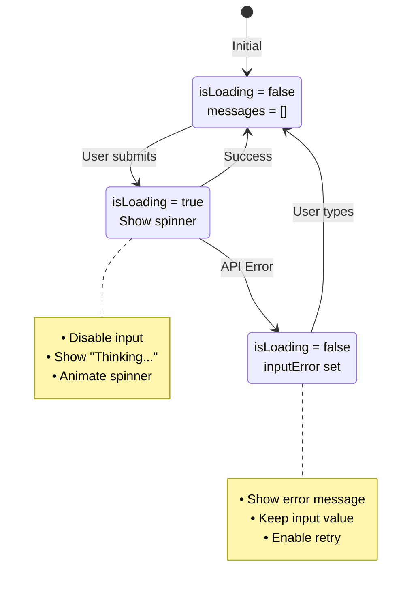

# ⏳ Loading States

> **Phần 7/9** - Flow Diagrams | [← Prev: Lifecycle](./06-lifecycle.md) | [Next: Keyboard Nav →](./08-keyboard-nav.md) | [Up: Index ↑](../README.md)

---

## State Diagram



---

## Component States

```javascript
// Idle
{ isLoading: false, inputError: '', messages: [] }
→ Show: TipsDisplay

// Loading
{ isLoading: true, inputError: '', messages: [...] }
→ Show: LoadingIndicator "Thinking..."

// With Todos
{ isLoading: false, todos: [...] }
→ Show: TodosDisplay

// Error
{ isLoading: false, inputError: 'API error...' }
→ Show: Error below input + error in conversation
```

---

## 🔗 Navigation

[← Prev: Lifecycle](./06-lifecycle.md) | [Next: Keyboard Nav →](./08-keyboard-nav.md) | [Up: Index ↑](../README.md)

---

**Last Updated**: 2025-01-08 | **Part**: 7/9
