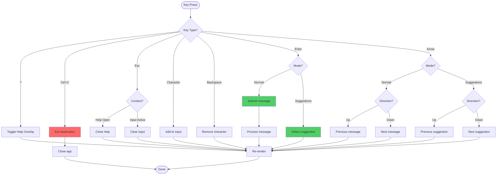

# ⌨️ Keyboard Navigation Flow

> **Phần 8/9** - Flow Diagrams | [← Prev: Loading States](./07-loading-states.md) | [Next: Performance →](./09-performance.md) | [Up: Index ↑](../README.md)

---

## Flowchart

---

## 🔗 Navigation

[← Prev: Loading States](./07-loading-states.md) | [Next: Performance →](./09-performance.md) | [Up: Index ↑](../README.md)

---

**Last Updated**: 2025-01-08 | **Part**: 8/9
