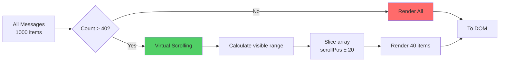
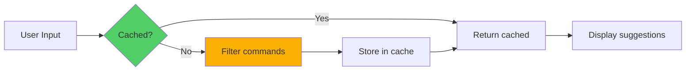

# 📊 Performance Optimization

> **Phần 9/9** - Flow Diagrams | [← Prev: Keyboard Nav](./08-keyboard-nav.md) | [Up: Index ↑](../README.md)

---

## Virtual Scrolling

---

## Suggestion Filtering

---

## 🔗 Navigation

[← Prev: Keyboard Nav](./08-keyboard-nav.md) | [Up: Index ↑](../README.md)

**Hoàn thành phần Flow Diagrams!**

Xem tiếp: [Quick Reference →](../quick-reference.md)

---

**Last Updated**: 2025-01-08 | **Part**: 9/9 (Final)
