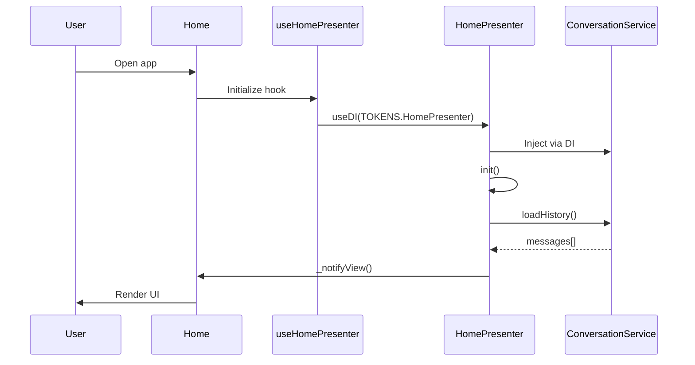
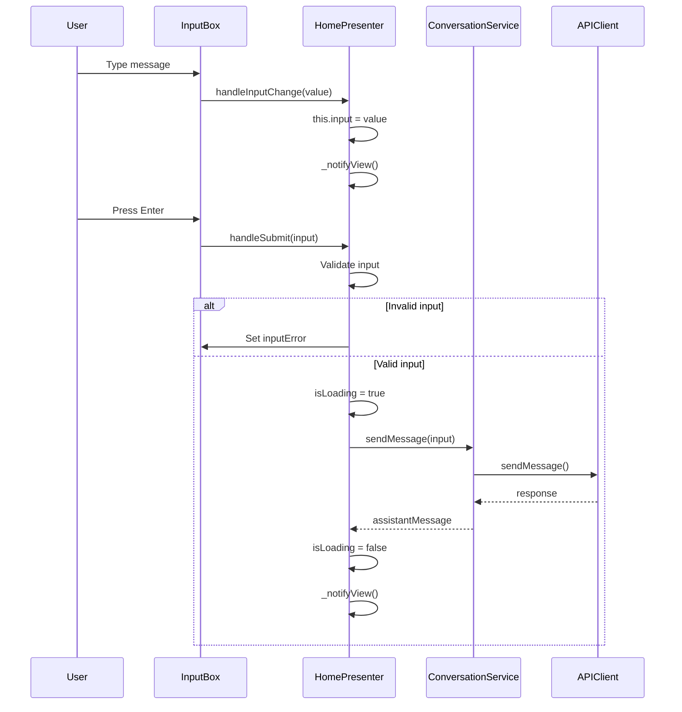
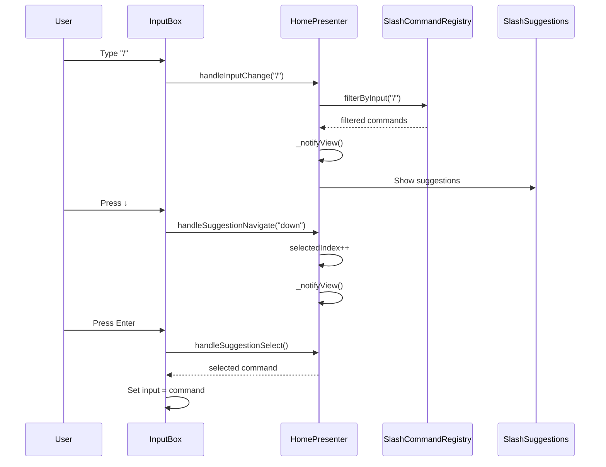

# ⚙️ Luồng Xử Lý Logic

> **Phần 3/9** - Technical Documentation | [← Prev: Components](./02-components.md) | [Next: SRS →](./04-srs.md) | [Up: Index ↑](../README.md)

---

## 1. Initialization Flow



---

## 2. User Input Flow



---

## 3. Slash Command Flow



---

## 4. State Update Flow

```javascript
// HomePresenter Internal Flow
_notifyView() {
  if (this.onViewUpdate) {
    this.onViewUpdate(this.getViewState());
  }
}

// useHomePresenter Hook
useEffect(() => {
  const handleViewUpdate = (viewState) => {
    setState(viewState);
  };

  presenter.setViewUpdateCallback(handleViewUpdate);
  presenter.init();

  return () => {
    presenter.setViewUpdateCallback(null);
  };
}, [presenter]);
```

---

## 🔗 Navigation

[← Prev: Components](./02-components.md) | [Next: SRS →](./04-srs.md) | [Up: Index ↑](../README.md)

---

**Last Updated**: 2025-01-08 | **Part**: 3/9
