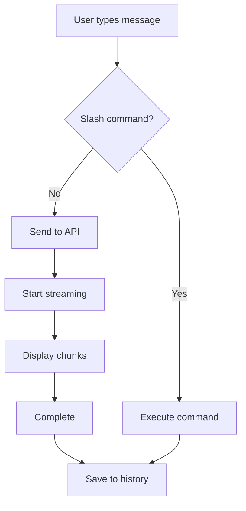
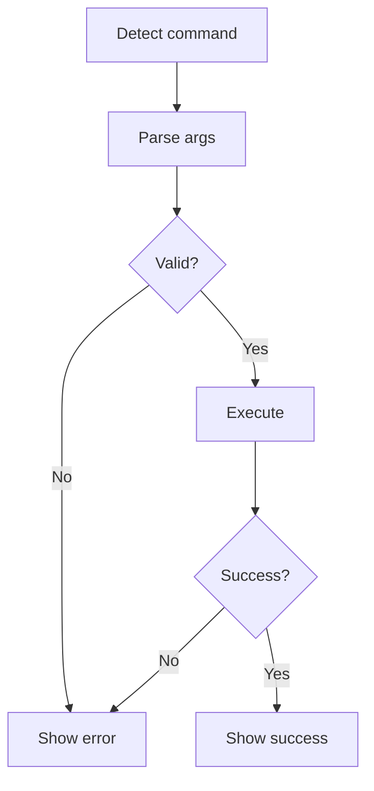

# Home Screen - User Flows

User interaction flows cho Home Screen.

## 1. Basic Chat Flow

```
User enters Home Screen
  → See empty conversation area
  → Type message in input box
  → Press Enter
  → Message sent to API
  → Streaming response appears word-by-word
  → Complete message displayed
  → Ready for next input
```

## 2. Slash Command Flow

```
User types "/"
  → Suggestions dropdown appears
  → User types command name (e.g., "/save")
  → Tab to complete or continue typing
  → Add arguments if needed
  → Press Enter
  → Command executed
  → Success message displayed
  → Input cleared
```

## 3. Session Save Flow

```
User types "/save my-session"
  → Validate session name
  → Create Session object with current messages
  → Save to file system
  → Show "✓ Session saved" message
  → Continue chatting
```

## 4. Session Load Flow

```
User types "/load my-session"
  → Check if session exists
  → Load session from file
  → Clear current messages
  → Display loaded messages
  → Show "✓ Session loaded" message
  → Ready for chat
```

## 5. Todos Management Flow

```
User types "add todo: Implement feature X"
  → Detect todo command
  → Create Todo object
  → Add to todos list
  → Display in todos panel (if visible)
  → Show "✓ Todo added" message
  → Continue chat

User toggles todos panel (/todos)
  → Panel slides in/out
  → Todos list visible/hidden
  → State persisted
```

## 6. Error Recovery Flow

```
API call fails
  → Catch error
  → Display error message in red
  → Offer retry option
  → User can retry or continue
  → Error state cleared on next successful request
```

## Flow Diagrams

### Message Send Flow



### Command Execution Flow



See [README](./README.md) for overview and [Technical](./technical.md) for implementation.
